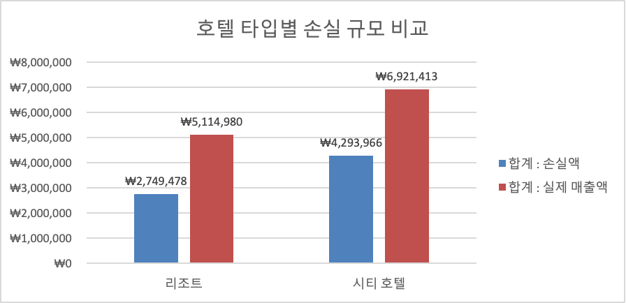
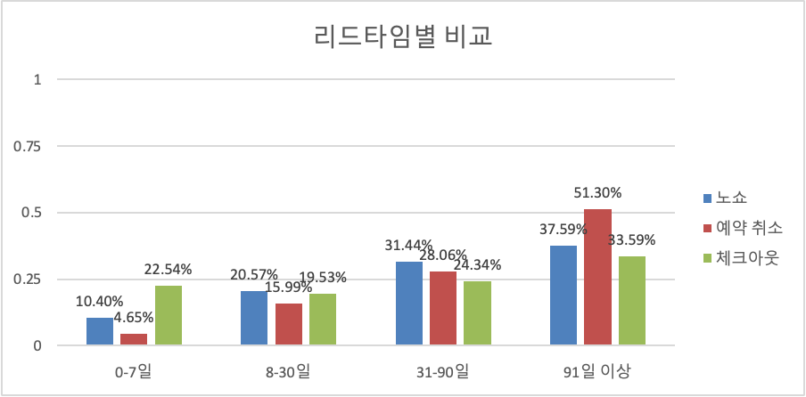
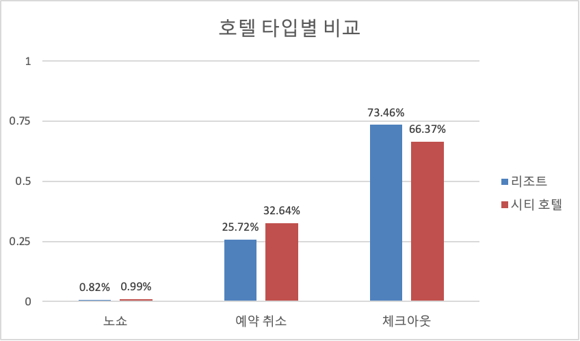
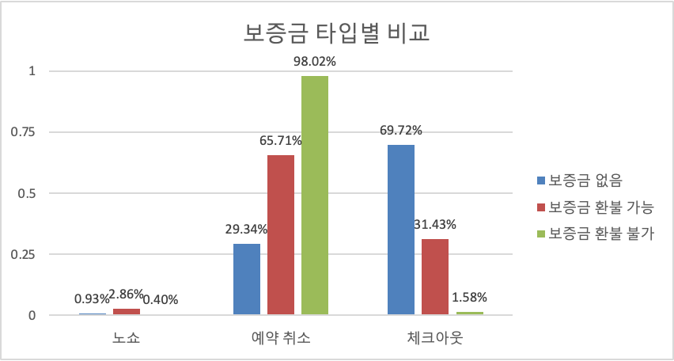
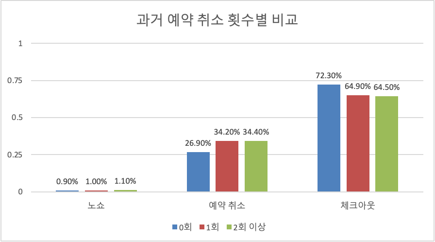

# 취소·노쇼 손실 최소화를 위한 데이터 분석 보고서

## 1. Executive Summary

2025년 1~12월 예약 데이터를 분석한 결과, 월별 취소율이 연초 25% 수준에서 연말 36%까지 지속적으로 상승했고, 이로 인한 연간 누적 손실액이 약 704만 원에 달하는 것으로 나타났다. 같은 기간 노쇼율은 1% 안팎에서 오히려 완만한 하락 추세를 보였다. 즉 두 문제 중 회사가 자원을 우선 투입해야 할 대상은 노쇼가 아니라 취소이며, 이 보고서는 그 근거와 대응 방향을 제시한다.

**핵심 인사이트**

- 리드타임 91일 이상 예약의 취소율(51.3%)은 0~7일 예약(4.7%)의 약 11배에 달해, 리드타임이 취소를 예측하는 가장 강력한 신호로 확인된다.
- 과거 취소 이력이 있는 고객의 재취소율(34%대)은 이력이 없는 고객(26.9%)보다 뚜렷하게 높아, 취소가 일부 고객군의 반복적 행동 패턴일 가능성을 시사한다.
- 환불불가 보증금 조건의 취소율이 오히려 전 구간 중 최고(98.0%)로 나타나, 현재 보증금 정책이 취소를 억제하는 실질적 기능을 하지 못하고 있을 가능성이 있다.
- 시티호텔의 취소율(32.6%)과 손실률(62.0%)이 리조트(25.7%, 53.8%)보다 높아, 호텔 타입에 따라 대응 우선순위를 차등화할 필요가 있다.

**제안 대책**

- ① 리드타임·취소 이력 기반 차등 보증금·수수료 정책
- ② 고위험 세그먼트 대상 리마인더 자동화
- ③ 환불불가 요금의 실질 위약금 수준 재설계

## 2. 분석 배경 및 목적

취소·노쇼는 해당 예약 건의 매출 손실로 끝나는 문제가 아니다. 임박 취소는 객실 재판매 기회를 놓치게 하고, 노쇼는 이미 배정·준비된 운영 리소스를 낭비시킨다. 즉 매출·객실 재고·운영 인력이라는 세 축에 동시에 영향을 미치는 구조적 문제이며, 따라서 특정 한 부서만의 대응으로는 해결이 어렵고 정책·영업·운영·데이터 부서의 공동 대응이 필요하다.

이 보고서의 목적은 두 가지다. 첫째, 어떤 고객·조건에서 취소·노쇼가 집중적으로 발생하는지 데이터로 규명하는 것이다. 둘째, 이를 근거로 실행 가능한 손실 최소화 방안을 제안하여 유관 부서의 협조를 이끌어내는 것이다. 본 보고서는 2025년 1~12월 리조트·시티호텔 예약 데이터 전체를 분석 범위로 설정했다.

## 3. 데이터 개요 및 분석 방법

분석에 사용한 데이터 항목은 예약 상태(취소/노쇼/체크아웃), 손실액·실제매출액, 리드타임, 호텔 타입, 보증금 타입, 과거 취소 이력이다. 이 항목들은 모두 취소·노쇼 발생 시점에 이미 확보 가능한 정보라는 공통점이 있어, 분석 결과가 그대로 사전 리스크 스코어링이나 정책 설계에 활용될 수 있다는 실무적 장점이 있다.

분석에 앞서 데이터 품질을 점검해 전처리를 진행했다. 예약정보 시트에서 예약번호가 중복된 행 5건을 제거했고, 어린이·영유아 인원 컬럼의 결측치는 최빈값인 0으로 대체했으며, 일 평균 요금이 음수(-)로 기록된 행은 데이터 오류로 판단해 제외했다.

분석은 다음 네 단계로 진행했다. ① 월별 취소·노쇼 추이를 파악해 문제의 시급성과 방향성을 확인하고, ② 리드타임·호텔타입·보증금타입·과거이력 등 세그먼트별 비교 분석으로 위험 요인을 특정한 뒤, ③ 각 패턴에 대해 외부 리서치를 대조해 원인 가설의 타당성을 검증하고, ④ 이를 종합해 실행 가능한 대책을 제안하는 순서다.

## **4. 현황 진단 — 취소/노쇼 규모와 손실**

### 4-1. 월별 예약·취소·노쇼 추이

가장 먼저 월별 예약 추이를 살펴본 이유는, 뒤이어 확인할 취소·노쇼 지표의 변화가 예약량 자체의 변화와 맞물려 있는지를 구분하기 위해서다. 이 그래프는 이후 분석 전체의 기준선 역할을 한다.

![[그래프 1]](images/image-00.png)

[그래프 1]

2월(4,150건) 이후 3~5월 연속 감소해 5월 최저점(2,800건)을 기록했으나, 6월부터 반등해 9월(4,500건) 이후로는 4,000건 이상의 높은 수준을 꾸준히 유지했다. 추세선 기준 연초 3,250건에서 연말 4,350건으로 완만한 우상향을 보여, 예약 자체는 견조하게 증가하고 있다고 판단할 수 있다.

![[그래프 2]](images/image-01.png)

[그래프 2]

![[그래프 3]](images/image-02.png)

[그래프 3]

월별 취소 비율

- 1~3월 27%대에서 등락(3월 23.7%로 저점)하다 4월 31.8%로 일시 급등, 5~7월 다시 25% 안팎으로 낮아짐. 그러나 8월부터 33%대로 재상승한 뒤 9~12월 지속 상승해 12월 36%까지 도달. 추세선 기준 연초 25% → 연말 35%로 뚜렷한 우상향
- **주목할 점**: 취소 비율이 높아지는 8월 이후 구간이 [그래프 1]에서 예약 건수가 늘어나는 구간과 겹침 → 예약이 늘어도 그만큼 취소도 함께 늘고 있어, 예약 증가가 실질 매출 증가로 온전히 이어지지 않고 있을 가능성

월별 노쇼 비율

- 0.55%~1.42% 사이에서 뚜렷한 방향성 없이 등락(6월·9월에 일시 급등 후 재하락). 추세선은 오히려 완만한 하락(1.05% → 0.83%)을 보임
- 노쇼는 변동성은 있으나 시간이 지날수록 악화되는 문제가 아님이 추세선으로 확인됨

**종합 판단**: 세 그래프를 함께 보면, 예약 자체는 늘고 있지만 그 증가분 이상으로 취소가 함께 늘고 있어 회사가 실제로 가져가는 매출 순증 효과가 제한적일 가능성이 큼. 반면 노쇼는 낮은 수준에서 오히려 하락 추세이므로 **대응 우선순위는 '취소'** 쪽에 있음 (노쇼 대응에 자원을 분산할 필요성은 낮음)

### 4-2. 손실 규모 — 손실액·실제매출액 기반

취소·노쇼 비율의 변화가 실제 금전적 손실로 어느 정도 이어지는지 정량화하기 위해 월별 손해금액과 누적 손실액을 분석했다.

![[그래프 4]](images/image-03.png)

[그래프 4]

- 월별 손실액은 1~7월 26만~52만 원 수준에서 큰 변동 없이 유지되다가, 8월(62만 원)부터 뚜렷하게 증가하기 시작해 9월 70만 원, 10월 79만 원, 11월 115만 원, 12월 129만 원까지 가파르게 상승
- 이 상승 시점(8월 이후)은 위 [그래프 2] 취소 비율이 33%대로 재상승한 시점과 정확히 일치
- 누적 손실액은 연초부터 꾸준히 쌓여 12월 기준 7,043,444원(약 704만 원)으로, 연간 누적 손실 규모의 최종 근거 수치

손실이 호텔 타입별로 어떻게 분포하는지 확인하면 대책을 우선 적용할 대상을 좁힐 수 있어, 이어서 리조트와 시티호텔을 비교했다.

- 리조트: 손실액 2,749,478원 / 실제매출액 5,114,980원 → 손실률 약 **53.8%**
- 시티호텔: 손실액 4,293,966원 / 실제매출액 6,921,413원 → 손실률 약 **62.0%**

시티호텔은 손실액 규모 자체도 리조트의 약 1.56배(429만 원 vs 275만 원)로 크지만, 매출 대비 손실 비중을 뜻하는 손실률 역시 62.0% vs 53.8%로 더 높다. 이는 시티호텔에서 매출 대비 취소로 인한 타격이 구조적으로 더 크다는 것을 의미하며, 대책의 우선순위를 호텔 타입별로 차등화하고 특히 시티호텔의 예약 채널·요금 구조를 먼저 들여다볼 필요가 있음을 시사한다. 다만 현재 수치는 재판매·부분환불이 반영되지 않은 상태이므로 실제 순손실은 이보다 낮을 수 있으며, 이후 리부킹률·취소 수수료 데이터를 확보해 추가 검증이 필요하다.

## 5. 취소·노쇼 고객 세그먼트 분석

4장에서 취소가 시급한 문제이며 손실이 계속 커지고 있다는 점을 확인했다면, 이 장에서는 어떤 조건의 예약에서 취소·노쇼가 집중적으로 발생하는지를 네 가지 축(리드타임, 호텔 타입, 보증금 타입, 과거 취소 이력)으로 나눈어 살펴본다.

### 패턴 1. 리드타임이 길수록 취소·노쇼 비율 급증

예약 시점부터 체크인까지의 간격, 즉 리드타임이 취소 위험과 관계가 있는지 확인하기 위해 리드타임 구간별로 노쇼·취소·체크아웃 비율을 비교했다.

리드타임 91일 이상 구간에서 노쇼 37.6%, 취소 51.3%로 전 구간 중 최고치를 기록했다. 이는 0-7일 구간(취소 4.7%) 대비 약 11배에 달하는 수치로, 리드타임이 길어질수록 취소·노쇼 위험이 뚜렸하게 커지는 패턴이 확인된다.

**외부 리서치 근거**

- 호텔 예약 취소를 다룬 여러 학술 연구(계층적 베이지안 모델링 등)에서 리드타임은 취소를 예측하는 가장 강력한 변수 중 하나로 반복 확인됨. 리드타임이 1 표준편차 늘어날 때 취소 확률이 약 82% 증가한다는 분석 결과도 있음.
- Kaggle 호텔 예약 데이터를 분석한 다수의 사례연구에서, 리드타임 365일 이상 구간은 취소율이 사실상 100%에 수렴하는 것으로 나타남. 리드타임이 길수록 취소율 편차(변동성)도 함께 커짐.
- 반대로 임박 예약(0일, 당일)은 취소 건수가 가장 많다가 리드타임이 늘수록 빠르게 줄어든다는 상반된 결과를 보인 연구도 있어, "예약 시점~체크인 시점 사이 간격"이 길수록 계획이 변경될 여지가 커진다는 해석이 일관되게 반복됨.

**원인 가설**

> 예약 시점과 체크인 시점 사이 간격이 길수록, 고객이 그 사이에 경쟁 상품을 발견하거나 일정·상황이 바뀔 노출 시간이 늘어나 이탈 확률이 높아지는 것으로 추정됨. 즉 장기 리드타임 예약은 "확정"이 아니라 "임시 홀드"에 가까운 성격을 가질 가능성이 있음.
> 

**대책 제안**

- 리드타임 구간별 차등 대응: 91일 이상 예약에 한해 중간 시점(예: 60일 전, 30일 전) 재확인 리마인더 자동 발송
- 장기 리드타임 예약에는 몰입도를 높이는 장치(특별 요청 입력 유도, 주차 등 부가 서비스 사전 신청) 도입
- 장기 예약 전용 보증금 정책 또는 단계적 확약(예: 60일 전 1차 확정) 절차 검토

### 패턴 2. 시티호텔이 리조트보다 취소·노쇼 비율 높음

호텔 유형 자체가 취소 성향에 영향을 미치는지 확인하기 위해 리조트와 시티호텔을 비교했다.

**데이터**: 노쇼(시티 0.99% vs 리조트 0.82%), 예약취소(시티 32.6% vs 리조트 25.7%) 모두 시티호텔이 소폭 높음.

**외부 리서치 근거**

- 동일한 유형의 데이터를 분석한 해외 연구에서도 일관되게 시티호텔의 기본 취소율(약 26~42%)이 리조트호텔(약 26~28%)보다 높게 나타남.
- 다만 한 실무 분석 사례에서는 "시티-리조트 격차는 고객군 자체의 차이보다, 두 호텔 타입이 판매하는 보증금(요금제) 구성 비율 차이로 더 잘 설명된다"는 반론도 제기됨. 즉 시티호텔이 환불불가 특가 비중을 더 많이 운영하고 있다면, 그 요금 구조 자체가 취소를 유발하는 원인일 수 있음.

**원인 가설**

> 시티호텔은 출장·단기 일정처럼 변경 가능성이 높은 예약 목적 비중이 클 뿐 아니라, 상대적으로 저가·단기 판촉 요금제(환불불가 특가 등) 판매 비중이 높아 취소가 구조적으로 발생하기 쉬운 예약 구성을 갖고 있을 가능성이 있음. 호텔 타입 자체보다 "어떤 목적·어떤 요금제로 예약되었는가"가 더 근본적인 원인일 수 있음.
> 

**대책 제안**

- 시티호텔의 취소 건을 예약 채널·요금제별로 재분류해, 특정 채널(OTA 등)이나 특가 요금제에 취소가 쏠려 있는지 우선 확인
- 시티호텔 직접예약 유도(리조트 대비 더 공격적인 direct booking 인센티브)로 취소율 높은 채널 의존도 완화
- 리조트와 시티호텔에 동일한 취소 정책을 적용하기보다, 호텔 타입별 별도 리스크 기준 운영

### 패턴 3. 환불불가 보증금인데도 취소율이 오히려 가장 높음

보증금(환불 정책)이 실제로 취소를 억제하는 기능을 하고 있는지 검증하기 위해 보증금 타입별 취소 비율을 비교했다.

**데이터**: 예약취소 중 보증금 환불불가 비율 98.0%로, 환불가능(65.7%)·보증금없음(29.3%)보다 오히려 높음.

**외부 리서치 근거**

- 동일한 패턴(환불불가 요금인데 취소율이 최고 수준으로 나타나는 현상)을 다룬 실무 분석 사례가 확인됨. 이 사례에서는 환불불가 요금이 보증금 있는 일반 요금보다 13~31% 가량 저렴하게 설계되어 있었고, 고객들이 이를 "확정 예약"이 아니라 "일단 잡아두고 나중에 버려도 되는 저비용 옵션(placeholder)"으로 활용하는 행태가 원인으로 지목됨. 실제 체크인으로 이어진 비율이 매우 낮았음에도, 할인폭이 커서 취소에 따른 손실이 고객 입장에서 부담스럽지 않았던 것.
- 다른 리서치에서도 환불불가 요금이 통상 9.5%~25% 수준 저렴하게 책정되며, 위험을 고객에게 넘기는 대신 가격으로 보상하는 구조임이 확인됨. 즉 "환불불가"라는 명목과 별개로, 실제 위약 금액이 크지 않다면 억제 효과가 제한적일 수 있음.

**원인 가설**

> 환불불가 조건이 명목상 존재하더라도, 실제 보증금 금액이나 요금 할인 폭이 작아 고객이 부담해야 할 실질적 손실(매몰비용)이 크지 않다면 취소를 억제하는 효과가 거의 작동하지 않는 것으로 추정됨. 즉 "환불 가능 여부"보다 "취소 시 실제로 얼마를 잃는가"가 취소 행동에 더 결정적인 변수일 가능성이 있음.
> 

**대책 제안**

- 환불불가 예약 건들의 실제 보증금 금액·할인율 데이터를 확인해, 현재 위약금 수준이 정가 대비 유의미한지 재검토
- 환불불가 요금제를 "무조건 저가"가 아니라 "취소 시 실질적 손실이 체감되는 수준"으로 재설계
- 환불불가 특가는 재판매가 어려운 성수기·고수요 기간에 한정 운영하여, 설령 취소되더라도 매출 영향을 최소화

### 패턴 4. 과거 취소 이력이 있는 고객의 재취소율이 유의하게 높음

취소가 무작위로 발생하는 사건인지, 아니면 특정 고객군의 반복 행동인지 확인하기 위해 과거 취소 이력별 재취소율을 분석했다.

**데이터**: 과거 취소 이력 0회(26.9%) 대비 1회 이상(34.2%), 2회 이상(34.4%)의 재취소율이 뚜렷하게 높음.

**외부 리서치 근거**

- 다수의 예측 모델링 연구에서 "과거 취소 이력"은 재취소를 예측하는 상위 중요 변수로 반복 확인됨. 한 분석에서는 과거 취소 이력이 1회 있는 고객군의 재취소율이 90%대 초반까지 나타나, 이력 없는 고객과 뚜렷한 격차를 보임.
- 반대로 "과거 예약을 취소 없이 완료한 이력"이 있는 고객은 재취소 확률을 낮추는 가장 강력한 변수 중 하나로 확인되어, 취소 이력 자체가 습관적·반복적 패턴에 가깝다는 해석을 뒷받침함.

**원인 가설**

> 취소는 일회성 사건이 아니라 특정 고객군의 반복적인 예약 습관(예: 여러 후보를 동시에 예약해두고 추후 선별)에 가까운 행동 패턴일 가능성이 있음. 과거 이력은 향후 취소 위험을 예측하는 데 가장 신뢰할 수 있는 신호 중 하나로 추정됨.
> 

**대책 제안**

- 고객 단위로 취소 이력을 플래그화하여 신규 예약 시 리스크 스코어링에 반영(고위험 고객 자동 태깅)
- 고위험 고객군에는 예약 확정 시 보증금 상향, 체크인 임박 재확인 절차 강화
- 반대로 완주 이력이 많은 충성 고객에게는 혜택을 부여해 리텐션 강화(취소 억제뿐 아니라 우량 고객 유지 관점에서도 활용 가능)

## 6. 종합 리스크 프로파일 — 세그먼트 교차 우선순위

5장에서 확인한 네 가지 위험 신호는 각각 독립적으로 유의미하지만, 실무에서는 이 신호들이 한 예약 건에 동시에 나타날 때 위험도가 배가될 가능성이 높다. 아래 표는 지금까지 확인한 신호를 한눈에 비교할 수 있도록 정리한 것으로, 리스크 스코어링 모델을 설계할 때 우선 검토할 조합을 제안하기 위한 것이다.

| 위험 신호 | 고위험 조건 | 근거 수치 |
| --- | --- | --- |
| 리드타임 | 91일 이상 | 취소율 51.3% (0~7일 대비 약 11배) |
| 과거 취소 이력 | 1회 이상 | 재취소율 34%대 (0회 대비 +7%p 내외) |
| 보증금 타입 | 환불불가 특가 | 취소율 98.0% (전 유형 중 최고) |
| 호텔 타입 | 시티호텔 | 취소율 32.6%, 손실률 62.0% |

<aside>
💡

**제안**: 네 가지 신호는 이번 분석에서 각각 개별적으로 검증된 것으로, 신호가 결합될 때의 실제 위험도는 아직 교차 검증되지 않았다. 예컨대 '리드타임 91일 이상 + 과거 취소 이력 보유' 또는 '시티호텔 + 환불불가 특가' 조합은 개별 신호보다 위험도가 더 높을 것으로 추정되며, 이는 데이터 부서와 협의해 교차 분석으로 우선 검증할 필요가 있다. 검증이 완료되면 이 네 가지 신호를 결합한 고객·예약 단위 리스크 스코어를 산출해 예약 확정 프로세스에 반영하는 것을 제안한다.

</aside>

## 7. 원인 분석 요약 및 시사점

네 가지 패턴을 관통하는 원인은 크게 두 갈래로 요약할 수 있다.

- 고객·예약 특성에 따른 구조적 이탈 성향 — 리드타임이 길거나 과거 취소 이력이 있는 예약은 애초에 "확정"이 아니라 "임시 홀드"에 가까운 성격을 가질 가능성이 높다. 이는 고객 행동을 예측하고 관리하는 관점의 대응(리마인더 자동화, 리스크 스코어링)이 필요함을 시사한다.
- 가격·정책 설계가 취소에 영향을 미치는 구조 — 환불불가 요금의 낮은 실질 위약금, 시티호텔의 특가 채널 비중 등은 상품·가격 설계에서 보완할 여지가 있는 지점이다. 이는 상품·가격 설계 관점의 대응(위약금 재설계, 채널·요금 믹스 조정)이 필요함을 시사한다.

두 원인은 서로 다른 부서의 협조를 필요로 한다는 점에서, 8장의 개선 방안 역시 이 두 갈래를 축으로 구성했다.

## 8. 개선 방안 제안

- **정책적 대책**
    - 리드타임·과거 취소 이력 기반 차등 보증금/취소 수수료 정책 (예: 91일 이상 예약 또는 재취소 이력 고객에게 강화된 조건 적용)
    - 환불불가 요금의 실질 위약금 수준 재설계(현재 할인폭·보증금 금액 재검토), 재판매 어려운 성수기·고수요 기간에 한정 운영
    - 시티호텔 예약 채널·요금제 믹스 재검토(취소율 높은 채널/특가 비중 축소, direct booking 인센티브 강화)
- **운영적 대책**
    - 리드타임 중간 시점(60일·30일 전) 고위험 세그먼트 대상 리마인더 자동화
    - 특별 요청·부가서비스 사전 신청 유도 UX 개선(몰입도를 높여 취소를 낮추는 장치로 활용)
    - 방배정 불일치 최소화

각 방안의 정량적 기대 효과는 현재 보유한 데이터만으로는 추정에 한계가 있어, 아래 표의 예상 효과는 정성적 방향을 제시한 것이다. 실행 우선순위를 확정하려면 데이터/재무 부서와 협의해 항목별 기대 효과를 리서치 항목으로 별도 검증할 것을 제안한다.

| 대책 | 유형 | 예상 효과 | 협조 부서 |
| --- | --- | --- | --- |
| 차등 보증금·수수료 정책 | 정책 | 고위험 세그먼트 취소율 완화 | 정책/영업, 데이터 |
| 환불불가 위약금 재설계 | 정책 | 매몰비용 확대로 취소 억제 | 정책/영업 |
| 시티호텔 채널·요금 믹스 재검토 | 정책 | 구조적 취소 비중 축소 | 정책/영업 |
| 리마인더 자동화 | 운영 | 고위험군 이탈 조기 방지 | 운영, IT |
| 부가서비스 사전신청 UX 개선 | 운영 | 몰입도 제고로 취소 감소 | 운영, UX |
| 방배정 불일치 최소화 | 운영 | 취소·노쇼 부수 리스크 완화 | 운영 |
| 리스크 스코어링 도입 | 정책+운영 | 고위험군 사전 식별 | 데이터, 운영 |

## 9. 결론 및 협조 요청 사항

<aside>
📌

**핵심 메시지**: 노쇼보다 취소가 문제이며, 방치할 경우 손실은 계속 우상향한다. 특히 현재의 보증금 정책은 취소를 억제하지 못하고 있다.

</aside>

이번 분석은 취소·노쇼가 무작위로 발생하는 것이 아니라 리드타임, 보증금 타입, 호텔 타입, 과거 취소 이력이라는 뚜렷한 조건에서 반복적으로 발생한다는 것을 보여준다. 이는 사전 예측과 정책적 개입이 가능한 문제라는 뜻이며, 아래와 같이 유관 부서의 구체적인 협조를 요청드린다.

**유관 부서별 협조 요청**

- 정책/영업 부서: 보증금·취소 수수료 정책 재검토, 환불불가 요금 설계 재검토, 시티호텔 채널·요금 믹스 재검토
- 운영팀: 리마인더 자동화 시스템 도입 검토, 방배정 프로세스 점검
- 데이터/재무 부서: 리부킹률·취소 수수료 실수령액 데이터 공유(순손실 재계산용), 리스크 신호 교차 검증을 위한 추가 분석 지원

본 보고서에서 제시한 수치는 재판매·부분환불이 반영되지 않은 상태이므로, 후속 협의를 통해 데이터를 보완하며 대책의 우선순위를 함께 확정해 나가고자 한다.