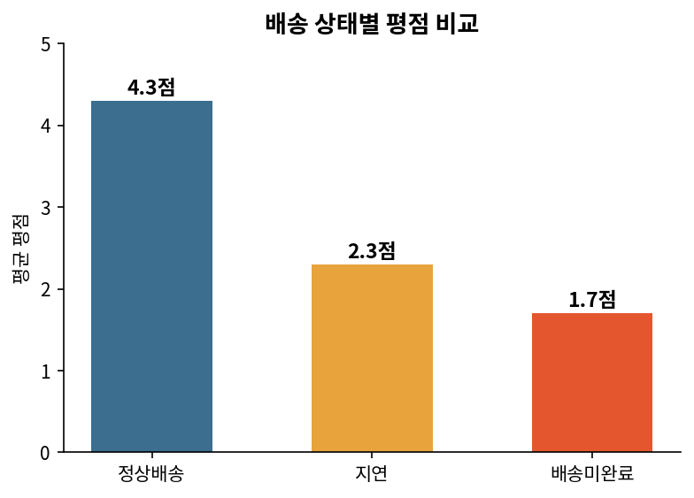
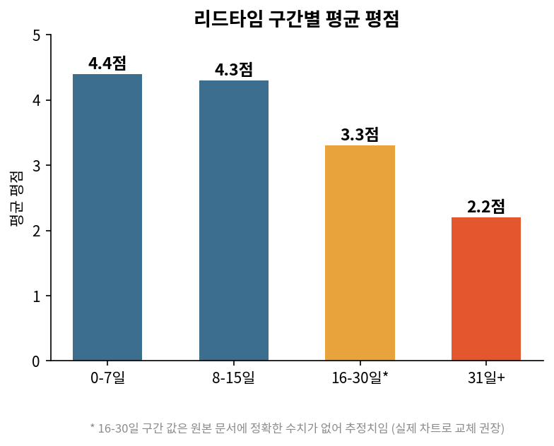
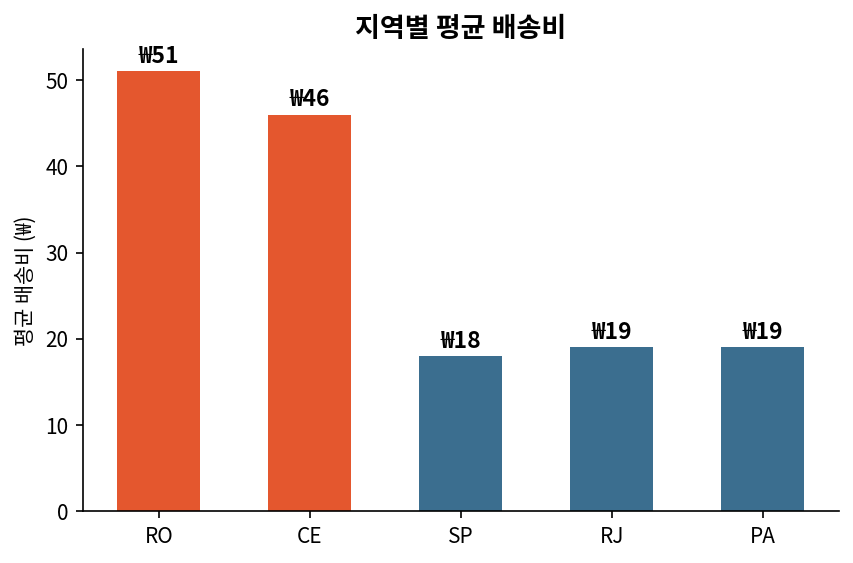
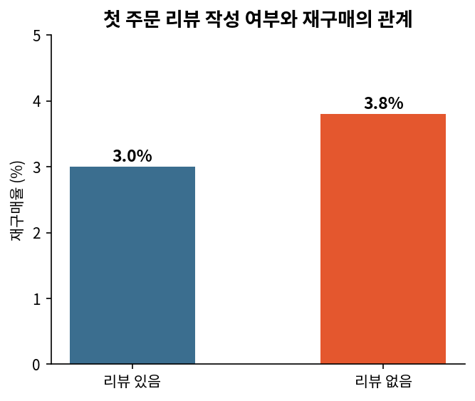
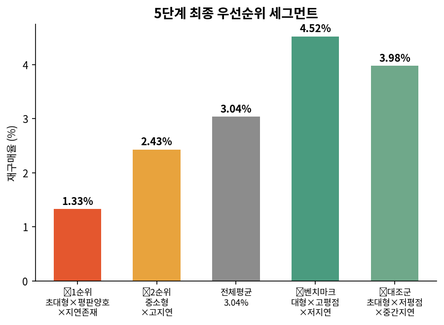

# 온보딩 과제 진행과정

> **마켓베이스(가상 이커머스 스타트업) 신입 데이터 분석가 온보딩 과제**
> Olist Brazilian E-Commerce Dataset(2016.09~2018.08, 주문 약 9.9만 건)을 활용해 "재구매율 하락" 현상을 데이터로 분해·검증한 프로젝트입니다.
> 📄 전체 분석 과정(원본 차트·표 포함 전체 버전): [Notion 문서 바로가기](https://app.notion.com/p/3b7e7053c8e0805ea370d86cda8f2534?source=copy_link)

---

## 프로젝트 개요

| 항목 | 내용 |
|---|---|
| 데이터셋 | Olist Brazilian E-Commerce Dataset (Kaggle 공개) |
| 관측 기간 | 2016.09 ~ 2018.08 |
| 분석 단위 | 고객 (`customer_unique_id`) |
| 전체 재구매율 | 3.04% (유효거래 기준) |
| 분석 방법론 | 8단계 데이터 분석 실무 가이드 (문제정의 → 데이터구조파악 → 전처리 → EDA → 교차세그먼트 → 세그먼트별 문제정의 → 액션아이템 → 검증계획) |
| 진행 상태 | 1~5단계 완료, 6~8단계 진행 예정 |

---

## 1단계. 문제정의

"재구매율 하락"에 대해 MD/CS/마케팅팀이 각기 다른 원인을 지목하는 상황을 가정하고, 현상을 원인이 다른 하위 유형으로 분리하는 것을 목표로 설정했습니다.

**하위 유형 분리**

| 유형 | 포함 여부 | 비고 |
|---|---|---|
| 배송 관련 불만 (지연) | ✅ 포함 | 배송 리드타임, 예정일 대비 지연 여부로 측정 |
| 특정 셀러 재구매 저하 | ✅ 포함 | 단일 셀러 주문 기준으로 측정 |
| 쿠폰/프로모션 미이월 | ❌ 제외 | 데이터셋에 캠페인/쿠폰 이력 없음 |
| 카테고리별 편차 | 보류 | 1차 분석 범위 밖 |

이를 바탕으로 **가설 A(배송 지연)**와 **가설 B(셀러 구조적 요인)** 두 축으로 문제를 좁혔습니다.

**측정 지표 선정**: 세그먼트별 재구매율 격차(상대 비교)를 채택했습니다. "재구매율 격차"는 하위 유형별 문제 크기를 직접 비교할 수 있어, 우선순위를 정해야 하는 이 프로젝트의 목적에 가장 적합했습니다.

**절단(censoring) 이슈 검증**: 최근 고객일수록 재구매를 관찰할 시간이 부족해 격차가 왜곡될 수 있다는 우려가 있었습니다. 확인 결과 지연을 겪은 고객의 최근 첫구매 비율(10.1%)이 정상배송 고객(19.2%)보다 오히려 낮아, "지연 세그먼트가 관측 시간이 부족해서 재구매율이 낮게 나온 것"이 아님을 검증하고 전체 표본으로 분석을 진행했습니다.

---

## 2단계. 데이터 구조 파악

원본 테이블(주문/품목/결제/리뷰/고객/상품/셀러)을 **분석 단위(grain)** 기준으로 2개 시트로 재구성했습니다.

- **시트 1 (주문 단위)**: 배송·리뷰 통합 — 리드타임, 지연 여부, `review_score`
- **시트 2 (품목 단위)**: 품목·셀러 통합 — 가격, 배송비, 셀러 소재지

review_score처럼 원래 주문 단위로 존재하는 값을 품목 단위 시트에 잘못 붙이면 다중 품목 주문에서 값이 중복 복제되어 분석이 왜곡되기 때문에, "그 값이 원래 어느 단위에서 태어났는가"를 기준으로 시트를 분리했습니다. 두 시트를 셀러 기준으로 다시 연결할 때는 `is_single_seller_order` 플래그로 필터링해 다중 셀러 주문의 오염을 방지했습니다.

결측치·이상치·라벨링 경계 케이스(상태값-날짜 모순 등)를 점검하고 처리 규칙을 확정했습니다.

---

## 3단계. 전처리

- **재구매 플래그**는 고객 단위로, **배송지연/셀러 정보**는 고객의 **첫 주문(first order)** 기준으로 대표 특성을 부착했습니다. (원인→결과의 인과 방향을 지키기 위해 반드시 첫 주문 기준으로 세그먼트를 정의)
- 주요 파생 변수: `delivery_lead_time_days`, `delay_status`(3분류), `repurchase_flag`, `first_order_delay_status`, `first_order_seller_id` 등

예비 확인 결과, 첫 주문 배송상태별 재구매율은 정상배송 3.06% / 지연 2.57% / 배송미완료 3.88%로, 예상과 다른 방향성이 이미 드러나기 시작했습니다.

---

## 4단계. 1차 분석/시각화 (가설 A vs B 검증)

> "전체 재구매율이 낮은데, 이 현상은 (A) 배송 관련 불만과 (B) 특정 셀러의 구조적 재구매 저하라는 서로 다른 원인을 가진 하위 유형으로 쪼갤 수 있다. 각 유형이 재구매 하락에 실제로 얼마나 기여하는지 정량화하고 우선순위를 정한다."

| 구분 | 분석 전 가설 | 검증 결과 | 판정 |
|---|---|---|---|
| **가설 A** (배송 지연·미완료) | 배송 문제를 겪은 고객은 재구매율이 낮을 것 | 평점·리뷰 미작성률은 악화되지만, 재구매율은 오히려 지연(2.6%) < 정상배송(3.1%) < 미완료(3.9%) 순으로 역방향 | 🔴 기각 (우선순위 ↓) |
| **가설 B** (특정 셀러) | 특정 셀러(구조적 요인)가 재구매 하락을 유발 | 고객 수 규모가 비슷해도 셀러 간 재구매율이 3배 이상 벌어짐(TOP16 8.3% vs TOP20 2.5%) | 🟢 강하게 지지 (우선순위 ↑) |

### 가설 A. 배송 지연/미완료 → 재구매 영향

**배송 상태별 리뷰 미작성률** — 배송 문제를 겪은 고객이 리뷰조차 안 남기고 조용히 이탈하는가?

정상배송 대비 지연은 4.3배, 배송미완료는 7.5배 리뷰 미작성률이 높습니다. 배송 문제가 클수록 침묵하고 이탈하는 고객이 늘어나는 패턴이라, 리뷰·평점만으로는 진짜 불만 규모를 과소평가할 수 있습니다.

**배송 상태별 평점 비교** — 배송 문제가 만족도를 얼마나 떨어뜨리는가?

정상배송 기준 평점 4.3점 대비 지연은 2.3점, 배송미완료는 1.7점으로 급락합니다. 미완료가 지연보다 확실히 더 치명적이라, 두 문제를 같은 강도로 묶어 대응하면 안 된다는 걸 시사합니다.

**리드타임 구간별 평균 평점** — 배송 개입이 필요한 구체적 임계 시점은?

0-7일(4.4점)→8-15일(4.3점)까지는 완만하지만 16-30일부터 눈에 띄게 꺾이고, 31일+ 구간에서 2.2점으로 급락합니다. 31일이 개입이 시급한 임계 구간으로, 향후 CRM 알림/보상 설계 시 기준점으로 쓸 수 있습니다.

**지역별 평균 배송비** — 배송 지연이 특정 지역(물류 인프라)에 구조적으로 몰려 있는가?

RO(₩51), CE(₩46)가 눈에 띄게 높고 SP(₩18)·PA(₩19)·RJ(₩19)는 낮습니다. 물류 접근성이 낮은 지역에 배송비 부담이 몰려 있어, 이 지역들이 지연 문제의 지리적 진원지일 가능성을 보여줍니다.

**[핵심 검증] 배송지연 vs 정상배송 재구매율 격차**

예상과 달리 배송미완료(3.9%) > 정상배송(3.1%) > 지연(2.6%) 순서로, 지연이 오히려 가장 낮습니다. 배송 지연 자체가 재구매 하락의 직접 원인은 아닐 가능성이 높습니다 — 가설 A는 평점·이탈에는 영향을 주지만 재구매 행동까지는 이어지지 않는다는 결론입니다. (배송미완료 고객의 재구매율이 오히려 높은 것은 보상 정책 가설이 있으나, 데이터셋에 쿠폰/캠페인 이력이 없어 현재는 검증 불가능한 미검증 가설로 남겨둡니다.)

**가격×판매량 산점도 보완 분석** (상관계수 ≈ 0.000): "저가 다량형/고가 소량형"으로 상위 셀러가 나뉜다는 가설은 기각되었고, 가격은 상위권 진입을 설명하는 변수가 아님이 확인되었습니다.

> ⚠️ 아래 차트들은 원본 문서에 정확한 수치가 없어(트렌드/범위만 서술) 이 문서에는 재구성하지 않았습니다 — Notion 링크 또는 원본 엑셀에서 확인하세요: 월별 지연율 추이, 전체 주문 상태 분포, 매출/판매량 상위 20개 셀러 랭킹, 가격×판매량 산점도(SVG)

### 가설 B. 특정 셀러 → 재구매 영향

**[핵심 검증] 고객수 상위 20개 셀러의 재구매율 편차**: TOP16 재구매율 8.3% vs TOP20 2.5%로 3배 이상 편차. 고객 수 규모로 설명되지 않는 편차라, 셀러 고유 요인이 재구매 하락에 실질적으로 기여한다는 가설 B를 강하게 지지합니다.

### 보조 변수

**첫 주문 리뷰 작성 여부와 재구매의 관계**

예상과 반대로 리뷰없음(3.8%)이 리뷰있음(3.0%)보다 재구매율이 더 높습니다. 리뷰 작성이 만족의 긍정 신호가 아니라, 재구매 없이 떠나는 고객의 마지막 이탈 신호일 가능성을 시사합니다 — 가설 A/B와는 별개의 액션 후보(리뷰 유도 캠페인)로 볼 수 있습니다.

**첫구매 후 경과기간별 재구매율과 고객 수**: 재구매율은 시간이 갈수록 계속 증가하지만, 실제 고객 수는 6-12개월에서 정점을 찍고 이후 급감합니다. 고객 수가 많으면서 재구매율도 오르는 골든타임은 6~12개월 구간 — CRM 발송 타이밍(D-60/D-30/D-3) 설계의 근거로 쓸 수 있습니다.

**방법론적 교정 사항**: 최초에는 차트를 개별적으로 해석했으나, 모든 차트를 가설 A/B 검증 프레임 아래로 통합해 재정리했습니다.

---

## 5단계. 교차 세그먼트 EDA — 우선순위 세그먼트 도출

가설 B가 강하게 지지됨에 따라, `first_order_seller_id` 기준으로 전체 셀러(3,018개)를 재집계해 규모·평점·자체 지연율·지역 축을 조합한 세그먼트 분석을 진행했습니다.

**단변량 재확인** (전체 평균 재구매율 3.04% 대비)

| 축 | 결과 |
|---|---|
| 셀러 규모 | 클수록 재구매율 ↑ (대형·초대형 3.17~3.25% vs 소형·중형 2.66~2.76%) |
| 셀러 평균 평점 | **저평점 셀러가 오히려 재구매율 ↑** (저평점 3.25% > 중간 3.02% > 고평점 2.75%) — 역설 |
| 셀러 자체 지연율 | 지연 적을수록 재구매율 ↑ (직관과 일치) |
| 지역 | SP·주요 지역(3.0%대)보다 일부 소수 지역이 뚜렷하게 낮음(2.06%, 표본 작음) |

평점과 자체 지연율은 셀러 단위에서 강한 음의 상관(r=-0.55)을 갖지만, 재구매율에 미치는 "방향"은 서로 어긋나는 역설적 패턴이 확인되어 교차 세그먼트로 분해했습니다.

**겹침(overlap) 문제 해결**: 2축 조합(규모×평점, 규모×지연 등) 시 세그먼트 간 최대 80% 중복이 발생해, 규모×평점×지연 3축을 동시에 조합한 **배타적 파티션**으로 재구성했습니다. (표본 300명 이상 조합만 채택, 전체 고객의 99.8% 커버)

**최종 우선순위 세그먼트**

| 구분 | 세그먼트 | 표본 | 재구매율 | 격차 | 임팩트 |
|---|---|---|---|---|---|
| 🔴 1순위 | 초대형(300명+) 셀러 × 평판 양호(중간평점 이상) × 지연 존재 | 3,621명 | 1.33% | -1.71%p | -62명 |
| 🔴 2순위 | 중·소형 셀러(20~99명) × 고지연(9%+) | 6,995명 | 2.43% | -0.61%p | -43명 |
| 🟢 벤치마크 | 대형(100-299명) × 고평점 × 저지연 | 2,034명 | 4.52% | +1.48%p | +30명 |
| 🟢 대조군 | 초대형 × 저평점 × 중간지연 | 5,559명 | 3.98% | +0.94%p | +52명 |

**핵심 해석 — 기대치 위반(Expectation Violation) 가설**

1순위 세그먼트가 압도적으로 심각합니다. "크다/지연이 있다" 자체가 문제가 아니라, 이미 평판이 형성되어 기대치가 높아진 대형 셀러에서 지연이 발생했을 때 실망이 특히 크게 작용하는 패턴으로 해석했습니다. 반면 대조군(초대형×저평점×중간지연)은 전체 평균보다 높은 재구매율(3.98%)을 보이는데, 애초 기대치가 낮았기 때문에 지연이 있어도 상대적으로 타격이 적었을 가능성으로 설명됩니다.

**외부 리서치로 뒷받침**: 이 패턴을 통계적 우연이 아닌 설명 가능한 현상으로 만들기 위해 다음을 조사했습니다.
- 기대불일치이론(Expectation-Disconfirmation Theory, Oliver 1977/1980) — 부정적 불일치가 재구매의도에 더 크고 비대칭적으로 작용
- 다만 항공·은행업 연구에서는 반대로 "브랜드 평판이 서비스 실패를 완충한다"는 결과도 존재 → Olist는 셀러 개별 브랜드가 아닌 "Olist 평판을 빌려 쓰는" 마켓플레이스 구조이므로, 개별 셀러에 대한 정서적 브랜드 충성심 형성이 구조적으로 어렵다는 점을 근거로 "브랜드 로열티 완충" 대신 **"성과 일관성 위반"** 프레임이 더 타당하다고 판단
- 브라질 이커머스 시장의 할부(parcelamento) 문화, 동시대 경쟁 플랫폼 동향, 지역별 물류 인프라 격차도 함께 검토

두 문제 세그먼트 합산 10,616명, 추정 손실 -105명(전체 재구매 고객 약 2,478명 대비 상당한 비중)으로 집계됩니다.

---

## 다음 단계 (예정)

- [ ] **6단계**: 세그먼트 확정 및 액션 아이템 도출 (예: 대형 셀러 대상 지연 조기경보 시스템) — 트레이드오프·오너십 명시
- [ ] **7단계**: 액션 아이템을 "개입 → 지표 변화량" 가설로 재작성, 검증 우선순위 1~2개 선정
- [ ] **8단계**: A/B 테스트 설계
- [ ] 지연×셀러 교차 세그먼트 차트 (계획 후 보류된 분석)

---

## 사용 도구

- **분석**: DuckDB SQL, Python/pandas, Excel 피벗테이블
- **시각화**: Excel 차트, SVG
- **문서화**: Notion ([전체 문서 링크](https://app.notion.com/p/3b7e7053c8e0805ea370d86cda8f2534?source=copy_link))

---

> 본 프로젝트는 가상 스타트업 "마켓베이스"의 신입 데이터 분석가 온보딩 과제 형식을 빌려, Olist 공개 데이터셋으로 실무형 분석 역량(SQL 추출, 퍼널/코호트/리텐션 분석, 가설 기반 A/B 테스트 설계, 유저 행동 정의)을 연습한 포트폴리오 프로젝트입니다.

---

### 이미지에 대한 참고사항
이 문서의 차트는 Notion 원본 페이지에 기재된 정확한 수치를 바탕으로 재구성한 것입니다(Notion의 이미지가 S3 서명 URL 형태라 외부에서 직접 가져올 수 없어 재구성함). 일부 차트(월별 트렌드, 셀러 랭킹, 산점도 등)는 원본에 개별 수치가 아닌 범위·패턴만 서술되어 있어 재구성하지 않았습니다 — 정확한 원본이 필요하면 Notion에서 이미지를 직접 저장해 `images/` 폴더에 추가하시면 됩니다.
