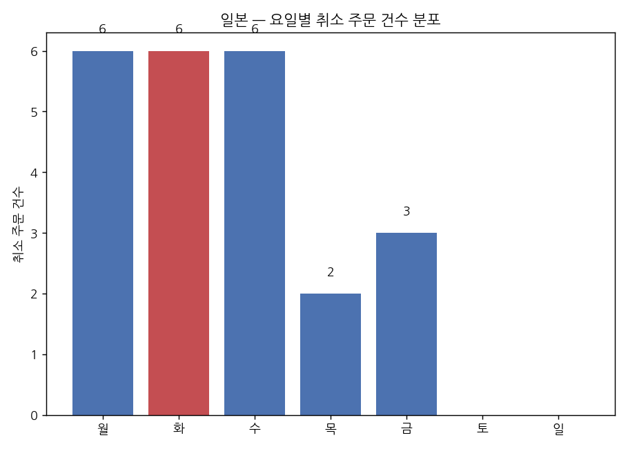
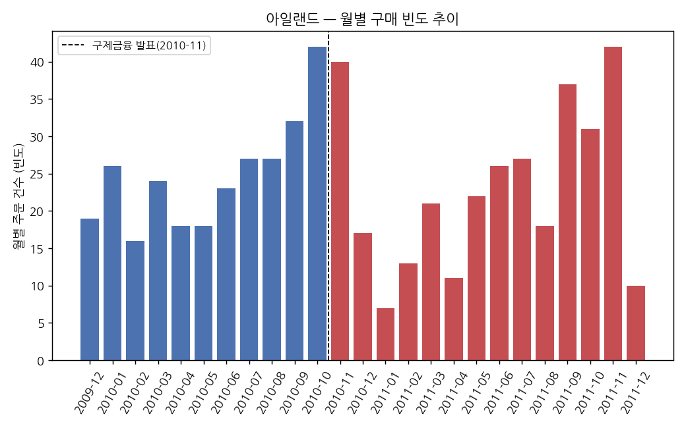
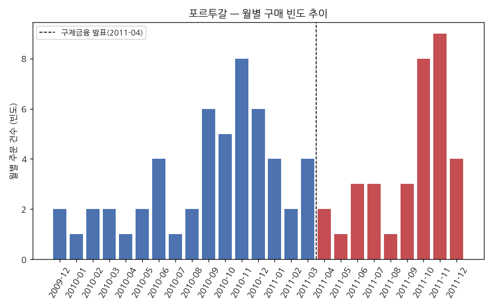
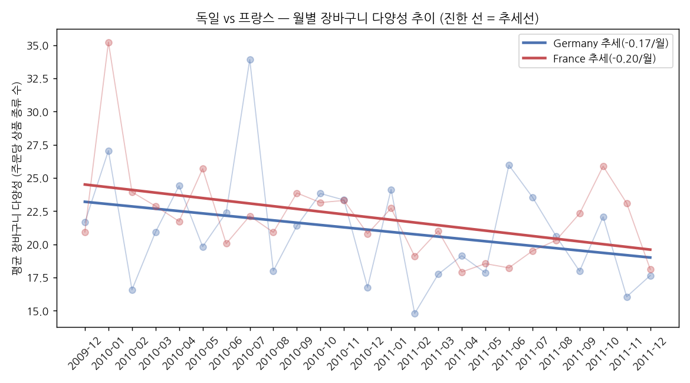

# 크로스보더 진출 우선순위 분석

## 목차

| 번호 | 섹션 | 하위 항목 |
|---|---|---|
| 1 | [프로젝트 개요](#1-프로젝트-개요) | |
| 2 | [데이터 분석 프로세스](#2-데이터-분석-프로세스) | |
| 3 | [사용 데이터](#3-사용-데이터) | |
| 4 | [데이터 처리 기준 및 판단 근거](#4-데이터-처리-기준-및-판단-근거) | |
| 5 | [국가별 소비자 행동 패턴과 이커머스 기업 대응](#5-국가별-소비자-행동-패턴과-이커머스-기업-대응) | 5.1 [일본](#51-일본) · 5.2 [아일랜드](#52-아일랜드) · 5.3 [포르투갈](#53-포르투갈) · 5.4 [독일 · 프랑스](#54-독일-프랑스) |
| 6 | [최종 결론](#6-최종-결론) | |
| 7 | [파일 구성](#7-파일-구성) | |

## 1. 프로젝트 개요

- **배경**: K-컬처의 글로벌 확산에 따라 B2C 이커머스 플랫폼 산업에서 크로스보더 트렌드가 확대되고 있음. 국가별로 어떤 마케팅 전략이 유효한지를 실거래 데이터로 분석.
- **데이터 제약**: Kaggle에서 확보 가능한 최근 시점 데이터는 대부분 합성(synthetic) 데이터였으며, 실거래 데이터는 2009~2011년 것이 유일하게 확인됨.
- **분석 방법**: 위 제약에 따라 2009~2011년 시점 데이터로 국가별 소비자 행동 패턴을 도출하고, 해당 시기 이커머스 기업의 마케팅 대응을 리서치로 보강해 국가별 전략 시사점을 정리한다.

## 2. 데이터 분석 프로세스

| 단계 | 내용 | 산출물 |
|---|---|---|
| Phase 1 | 시장조사 및 문제정의 | 문제의식, 리서치 체크리스트 |
| Phase 2 | 데이터 전처리 | 정제 데이터, 핵심 플래그(도매상/신뢰도) |
| Phase 3 | 지표 설계 | 국가별 매력도·효율성 지표, 우선순위 매트릭스 |
| Phase 4 | 소비자 행동 패턴 분석 및 리서치 | 국가별 미시 행동·이커머스 대응 전략 |
| Phase 5 | 최종 결론 | 사회·시대적 맥락 - 소비자 행동 - 마케팅 전략 종합 |

## 3. 사용 데이터

- Online Retail II (UCI / Kaggle), 2009-12-01 ~ 2011-12-09, UK 기반 온라인 소매업체 실거래 데이터, 40개국, 약 106만 건

## 4. 데이터 처리 기준 및 판단 근거

파이프라인 전 구간에서 이뤄진 주요 판단을 고려 사항별로 분류해 정리한다.

### 4.1 소비자 유형 구분
분석 목적("B2C 소비자에게 브랜드가 어디서 통하는가")과 무관한 거래를 분리하기 위한 처리.

| 판단 지점 | 처리 기준 | 근거 |
|---|---|---|
| 소매/도매 구분 | 고객별 총 구매수량 상위 1%를 도매상으로 추정하는 플래그 설계 | 재판매업자 거래가 섞이면 매출·수량 지표가 소수 대량구매자에 의해 왜곡됨 |

### 4.2 결측치 및 표본 신뢰도
값이 없는 것과 신뢰할 수 없는 것을 구분해, 결측이 곧 결론 왜곡으로 이어지지 않도록 하는 처리.

| 판단 지점 | 처리 기준 | 근거 |
|---|---|---|
| Customer ID 결측(22.77%) 처리 | 삭제 대신 분석 목적별로 데이터 분리(매출 기반 분석용 / 고객 단위 분석용), 국가별 표본 신뢰도 플래그 설계 | 국가별 결측 비율 편차가 커 무작위 결측이 아님을 확인. 일괄 삭제 시 실제 시장성이 아닌 결측 발생 패턴에 의해 결과가 왜곡됨 |
| 표본 신뢰도 임계값 | 결측률 50% 미만 & 거래 30건 이상을 만족해야 고객 단위 지표 신뢰 | 표본 30 이상은 중심극한정리(CLT)에 따라 표본평균이 정규분포에 근사하는 최소 기준 |

### 4.3 이상치 처리
극단값의 발생 원인이 서로 다를 수 있다는 전제 하에, 원인별로 다르게 다룬 처리.

| 판단 지점 | 처리 기준 | 근거 |
|---|---|---|
| 이상치 처리 방식 | IQR 대신 규칙 기반 분리(취소거래·재고조정·비상품코드·대손상각을 각각 다른 조건으로 식별) | Quantity·Price의 극단값은 하나의 동질적 분포에서 벗어난 통계적 이상치가 아니라, 서로 다른 발생 원인이 섞인 이질적 거래 유형이었음. IQR 일괄 적용 시 유효한 도매상 거래가 삭제되거나, 반대로 재고조정처럼 제외돼야 할 값이 걸러지지 않는 문제가 발생 |

### 4.4 지표 계산 원칙
개별 지표를 계산할 때, 그 지표의 성격에 맞는 기준 데이터와 임계값을 선택하기 위한 처리.

| 판단 지점 | 처리 기준 | 근거 |
|---|---|---|
| 반기 성장률 신뢰도 | 첫 반기 주문 10건 미만 국가는 성장률을 결측 처리 | 분모가 되는 초기 표본이 작을 경우 소폭 증가도 비율상 극단값으로 나타나는 착시가 발생함을 확인 |
| ARPU 신뢰도 필터 | 매력도 점수 계산 시 ARPU_retail에도 표본 신뢰도 필터를 동일하게 적용 | 필터 미적용 시 고객 0~1명인 국가가 분모가 0에 가까워지며 "최고 매력도"로 오분류되는 오류를 확인, 필터 추가로 해결 |
| 세그먼트 신뢰 기준 | 고유 고객 5명 이상인 국가만 최종 우선순위 분류에 반영 | 표본이 극단적으로 작은 국가가 우선순위 상위권에 오분류되는 것을 방지 |
| 점수화 방식 | 절대값이 아닌 qcut 5분위 순위 기반 점수화 | 국가 간 지표 규모 편차가 크고 왜곡된 분포에서도 상대적 순위 비교가 가능해야 함 |

## 5. 국가별 소비자 행동 패턴과 이커머스 기업 대응

Phase 3의 매트릭스는 국가 단위 총량 지표다. 총량 지표 이면의 개별 소비자 행동(장바구니 구성, 주문 단위 금액, 취소 패턴)을 확인하고, 해당 시기 이커머스 기업의 마케팅 대응을 리서치로 보강했다.

**국가 선정 기준**: Phase 3 매트릭스에서 다른 국가와 다른 패턴을 보인 곳을 우선 선정했다.
- 일본: 표본이 크지 않은데도(56건) 취소율이 유럽 평균의 2~6배로 뚜렷하게 높게 나타남
- 아일랜드·포르투갈·독일·프랑스: 유럽 재정위기(2010~2012) 시기와 데이터 기간이 겹치며, 매트릭스 상 매력도·효율성 점수가 서로 다른 방향으로 갈린 주요 표본국 — 아일랜드(위기 직격), 포르투갈(같은 위기국이나 다른 양상), 독일(위기 중 안정), 프랑스(대국이지만 효율성 저하)

### 5.1 일본

아래 그래프는 일본의 취소 주문을 요일별로 집계한 것이다. 취소가 요일마다 고르게 퍼져있지 않고, 월~수요일에 몰려있다가 목·금요일엔 줄고 주말엔 완전히 사라지는 패턴이 나타난다.

| 구분 | 내용 |
|---|---|
| 데이터 확인 | 취소율 16.67%(유럽 평균 2.7~6%의 2~6배), 취소 주문이 월·화·수요일에 각 6건으로 집중, 주말엔 0건 |
| 소비자 행동 패턴 | 소액 위주 다품목 구매 후 결제 단계 이탈 · 취소가 주중 초반(월~수)에 몰리고 주말엔 없음(운영 배치처리 가능성) · 카드결제 비중이 낮은 시장(현재도 약 50% 수준) |
| 이커머스 기업 마케팅 전략 | 편의점 결제(Pay-easy 등) 대안 결제수단 도입 · 랭킹·리뷰 기반 신뢰 마케팅 · 직구 특성상 1회 다품목 구매 성향을 활용한 크로스셀링 |
| 결과 | 상품 품질·반품문화 가설 기각, 결제 신뢰 부족에 따른 이탈로 원인 특정 |
| 고려 전략 | 결제수단 현지화, 체크아웃 투명성 강화 |

### 5.2 아일랜드

아래 그래프는 아일랜드의 월별 주문 건수(구매 빈도) 추이를 구제금융 발표 시점(점선) 기준으로 색을 나눠 보여준다. 발표 이후에도 빈도가 뚝 끊기지 않고 등락을 반복하며 유지되는 패턴이 나타난다.

| 구분 | 내용 |
|---|---|
| 데이터 확인 | 위기(2010-11) 이후 AOV -21.5%(1,191→935파운드)인데도 월별 주문 빈도는 유지·등락 반복 |
| 소비자 행동 패턴 | 구매 빈도·장바구니 다양성은 유지, 건당 지출 규모만 축소 |
| 이커머스 기업 마케팅 전략 | Nielsen(2011, 51개국 2.5만 명 조사): 경기침체기 소비자는 "저가"보다 "가치" 중시, 프로모션 민감도 상승 · 아일랜드 특정 기업 대응 근거는 확인되지 않음 |
| 결과 | "덜 자주 사는 것"이 아니라 "여전히 자주 사되 건당 지출을 줄이는" 패턴. 실제 반등은 2014년부터(데이터 종료 이후) |
| 고려 전략 | 가치 중심 프로모션 대응, 정책 회복 신호 모니터링 |

### 5.3 포르투갈

위 그래프의 오른쪽이 포르투갈이다. 구제금융 발표 이후에도 빈도가 줄어들지 않고, 오히려 후반부(2011-09~11)에 늘어나는 구간이 나타난다.

| 구분 | 내용 |
|---|---|
| 데이터 확인 | AOV -7.5%(569→526파운드)인데도 월별 주문 빈도는 위기 이후에도 유지·일부 증가 |
| 소비자 행동 패턴 | 주문 빈도는 유지·일부 증가, 건당 지출만 완만히 축소 · 총매출로는 드러나지 않는 미시적 위축 |
| 이커머스 기업 마케팅 전략 | 아일랜드와 동일한 업계 트렌드(Nielsen 가치중심 프로모션) — 국가 특정 사례는 미확인 |
| 결과 | 총매출 기준 오판 가능 지점을 미시지표가 보정. 실제로도 2012~13년 악화 |
| 고려 전략 | AOV 등 미시지표를 병행 모니터링 |

### 5.4 독일 · 프랑스

아래 그래프는 독일·프랑스의 월별 장바구니 다양성(주문당 상품 종류 수) 추이에 선형 추세선을 함께 표시한 것이다. 옅은 선(월별 실측치)은 등락이 크지만, 진한 추세선을 보면 두 나라 모두 완만한 하락세를 보인다는 공통 패턴이 확인된다.

| 구분 | 독일 | 프랑스 |
|---|---|---|
| 데이터 확인 | 장바구니 다양성 월 -0.17개 하락 추세, 최대 표본(107명), 도매상 왜곡 최소(8.3%) | 장바구니 다양성 월 -0.20개 하락 추세, 표본 94명(효율성 지표는 낮음) |
| 소비자 행동 패턴 | 완만한 하락이나 프랑스보다는 낙폭이 작음 | 완만한 하락, 독일보다 낙폭이 약간 큼 |
| 이커머스 기업 마케팅 전략 | 후불(송장) 결제(Kauf auf Rechnung) 방식이 오래전부터 핵심 신뢰 구축 수단 | 벙트프리베(Vente-Privee) 등 한정시간 플래시세일 모델 급성장(2010년 매출 9.68억 유로, +15%), 프랑스 전체 온라인매출 2009~2010년 +22%(Fevad) |
| 결과 | 최대 표본·최소 왜곡이라는 강점은 유효하나, 장바구니 다양성 자체는 위기 영향을 받았음 | 업계 성장과 개별 소비자 장바구니 축소가 동시에 관찰됨 |
| 고려 전략 | 신뢰 기반 결제옵션 제공 | 시장 전체 지표와 개별 소비자 단위 지표 병행 확인 |

## 6. 최종 결론

이 결론은 국가 우선순위를 매기는 것이 아니라, **소비자 행동이 어떤 사회·시대적 맥락에서 어떤 패턴으로 나타났고, 그 국면에서 어떤 마케팅 전략이 효과적이었는지**를 국가별로 종합하는 데 있다. 다섯 국가는 Phase 3 매트릭스에서 다른 국가와 구분되는 패턴(취소율 이상치, 유럽 재정위기 시기 상반된 반응)을 보여 선정했다.

| 국가 | 사회·시대적 맥락 | 소비자 행동 패턴 | 효과적이었던 마케팅 전략 |
|---|---|---|---|
| 일본 | 비현금 결제 인프라 미비, 카드결제에 대한 문화적 기피 | 주중 초반(월~수)에 몰린 소액 시험구매 후 이탈, 주말엔 취소 없음 | 편의점 대안 결제수단 도입, 랭킹·리뷰 기반 신뢰 마케팅 |
| 아일랜드 | 2010-11 EU·IMF 구제금융, 긴축 재정 | 구매 빈도는 유지, 건당 지출만 지속 축소(AOV -21.5%) | 가치 중심 프로모션(Nielsen 2011 업계 트렌드) |
| 포르투갈 | 같은 위기 3국 중 하나, 긴축에도 실물경기 지속 악화 | 구매 빈도는 유지·일부 증가, 건당 지출은 완만히 축소 | 아일랜드와 동일한 가치 중심 프로모션 트렌드 |
| 독일 | 유로존 위기 중 자본이 몰리는 안전자산 경제 지위 | 장바구니 다양성이 완만히 하락하나 상대적으로 낙폭이 작음 | 후불(송장) 결제를 통한 신뢰 구축 |
| 프랑스 | 2011년 하반기 신용등급 강등 우려 고조 | 장바구니 다양성이 독일보다 더 큰 폭으로 하락 | 한정시간 플래시세일을 통한 긴급성 마케팅(벙트프리베) |

국가별 데이터 수치와 세부 근거는 [5. 국가별 소비자 행동 패턴과 이커머스 기업 대응](#5-국가별-소비자-행동-패턴과-이커머스-기업-대응)에 정리했다.

## 7. 파일 구성

| 파일 | 설명 |
|---|---|
| `crossborder_analysis.ipynb` | 전처리 → 지표설계 → 데이터 산출물(우선순위 매트릭스·상품요약·리스크요약) → 소비자 행동 패턴 분석 → 최종 결론까지 전 과정을 포함한 단일 파일. 코드 실행 결과(표·그래프)가 저장되어 있어 재실행 없이 확인 가능 |
| `images/` | Phase 4 국가별 소비자 행동 그래프(PNG) |
